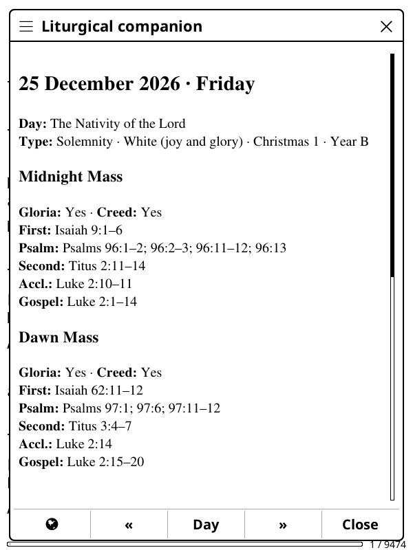
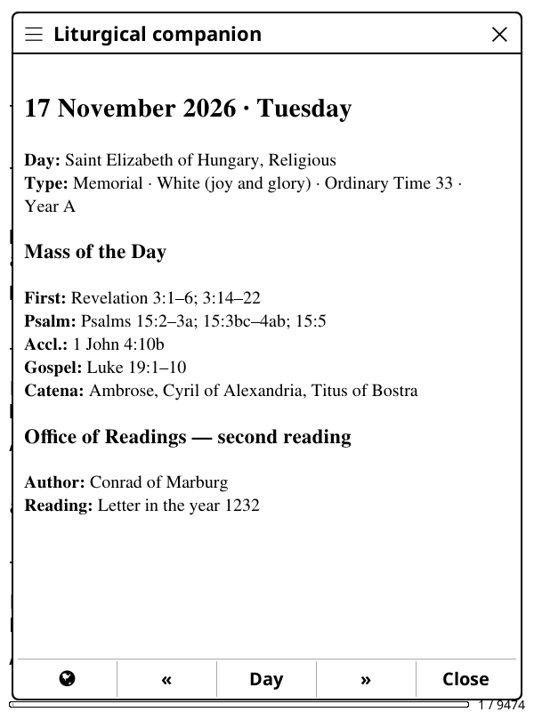
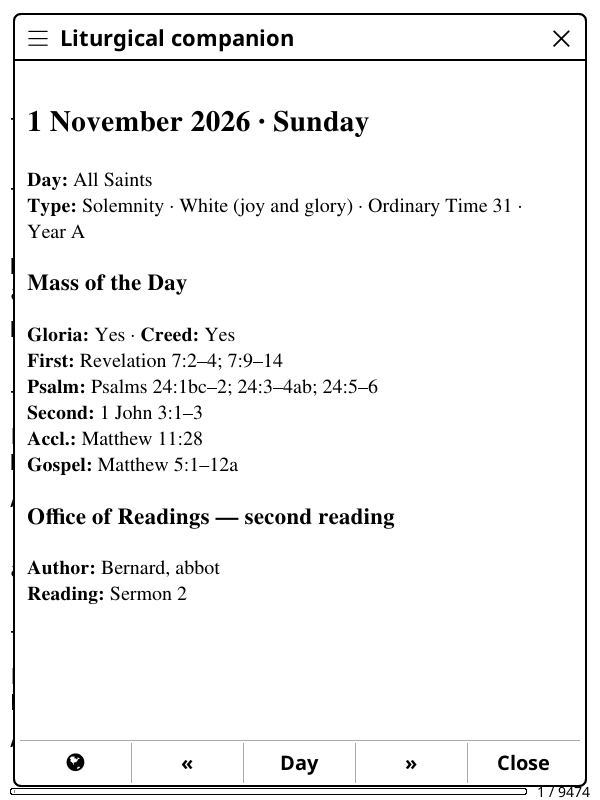
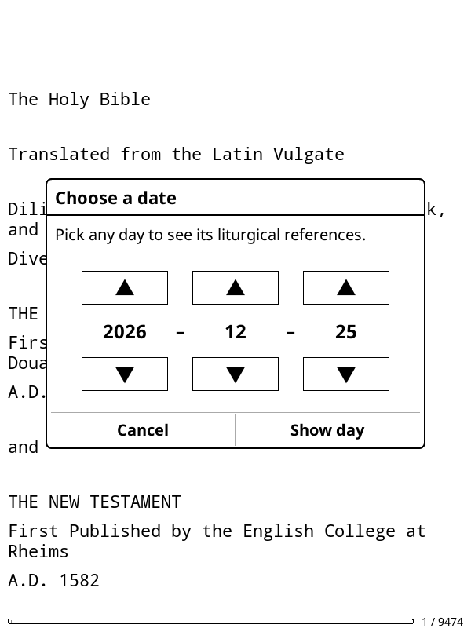
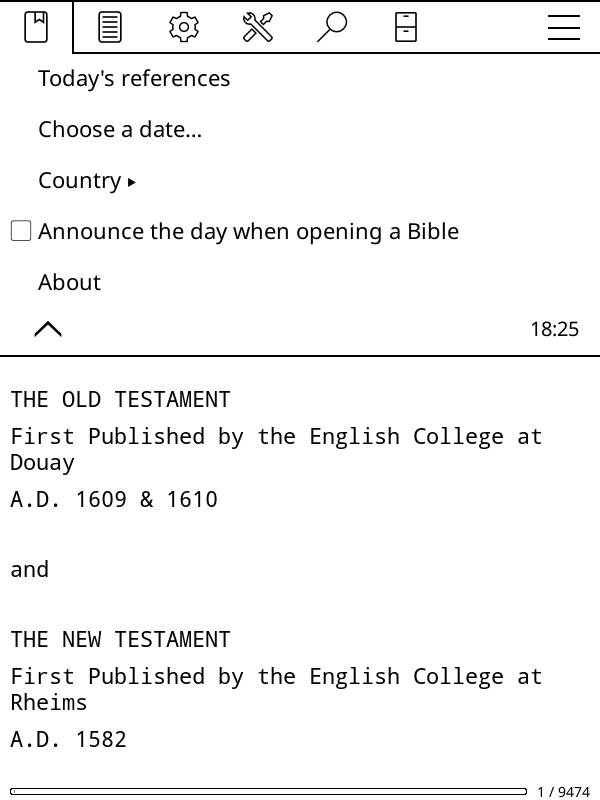
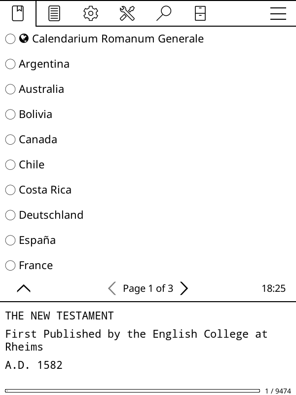
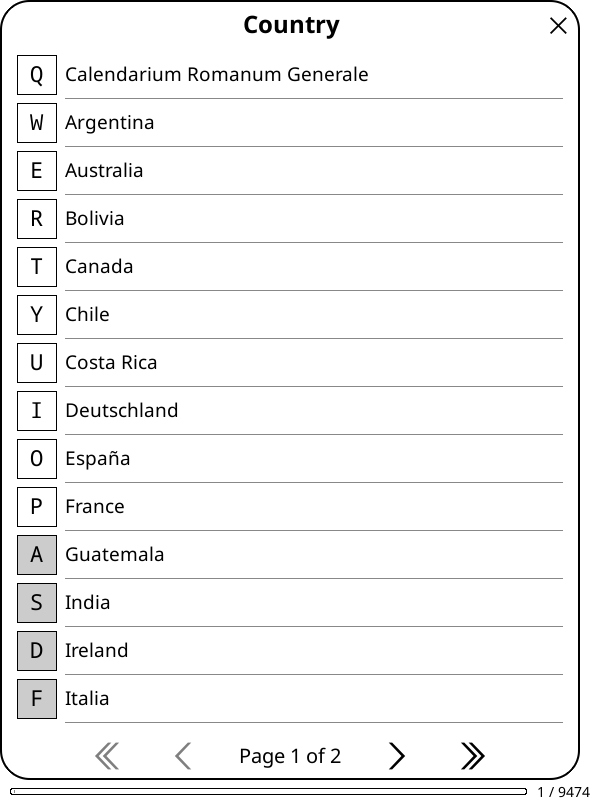
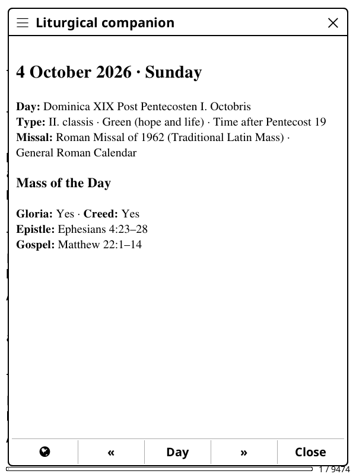
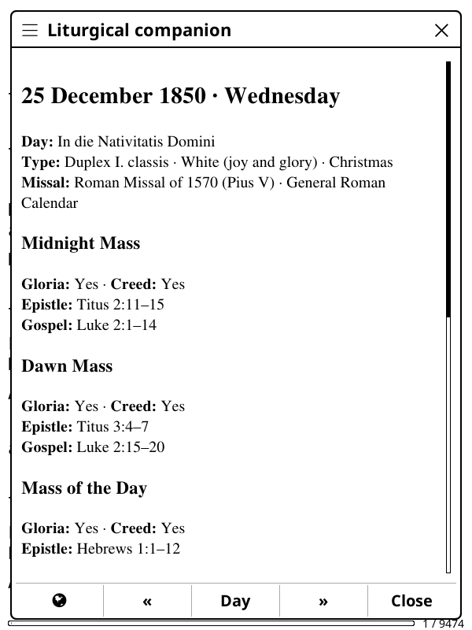
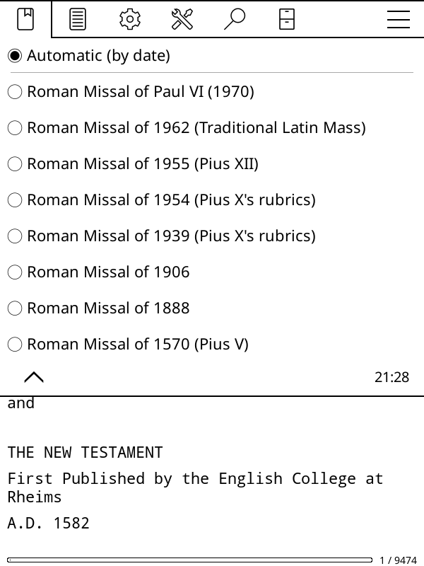

# Liturgical Companion for KOReader

**The day's liturgy, one tap away while you read.**

Liturgical Companion is a small offline plugin for [KOReader](https://koreader.rocks).
Open it on any day to see:

- **the liturgical day**: its full name, rank, colour, season and year cycle
- **the saints and martyrs** celebrated, with each one's rank
- **the Mass readings** for every Mass of the day (Vigil, Night, Dawn, Day…)
- **the Office of Readings** second reading: author and work
- **the Gospel commentary**: which Fathers the Catena Aurea quotes on the day's Gospel

  

It works fully offline, with no account and no network access, and is built for
e-ink (Kindle, Kobo, PocketBook, Android). It can be installed and updated with
the [AppStore plugin](https://github.com/omer-faruq/appstore.koplugin).

## Screenshots

<table>
  <tr>
    <td align="center"> A weekday: memorial, readings, commentary, Office</td>
    <td align="center"> A solemnity</td>
    <td align="center"> Choose any date</td>
  </tr>
  <tr>
    <td align="center"> Tools → More tools → Liturgical companion</td>
    <td align="center"> Choose your calendar</td>
    <td align="center"> 🌐 View the day in another country</td>
  </tr>
  <tr>
    <td align="center"> Traditional Latin Mass (1962 Missal)</td>
    <td align="center"> Christmas 1850, in the Missal of the day</td>
    <td align="center"> Choose the Missal edition</td>
  </tr>
</table>

## Install

**With [AppStore](https://github.com/omer-faruq/appstore.koplugin):** search for
*liturgical-companion* and choose **Install**.

**By hand:**

1. Download **`liturgical-companion.koplugin-vX.Y.Z.zip`** from the
   [latest release](https://github.com/mabbamOG/liturgical-companion.koplugin/releases/latest).
2. Unzip it into KOReader's `plugins` folder, so you get
   `koreader/plugins/liturgical-companion.koplugin/`.
3. Restart KOReader.

## Use

Open any book, then go to **Tools → More tools → Liturgical companion**:

| Menu item | What it does |
|---|---|
| **Today's references** | Opens the panel for today |
| **Choose a date…** | Opens the panel for any date |
| **Country** | Sets your calendar and its language |
| **Announce the day when opening a Bible** | Optional tappable notice when you open a Bible |

The row at the bottom of the panel:

| 🌐 | « | Day | » | Close |
|---|---|---|---|---|
| View this day in another country (just for now) | Previous day | Pick a date | Next day | Close |

Tip: add *Liturgical companion: today* to a gesture in
**Tools → Gesture manager**.

## Calendars

The **General Roman Calendar** (in Latin) and 27 national calendars, each shown
in its own language: Argentina, Australia, Bolivia, Canada, Chile, China,
Costa Rica, Deutschland, España, France, Guatemala, India, Ireland, Italia,
México, New Zealand, Österreich, Panamá, Paraguay, Perú, Philippines, Polska,
Puerto Rico, Scotland, U.S.A., Uruguay, Venezuela.

Languages: English, Latin, Italian, German, French, Spanish, Polish and
Simplified Chinese.

**Any year from 1583 to 9999.** Nothing is stored per day: the plugin computes
each day on your device from the liturgical rules (Easter and the seasons,
feasts and their precedence, national transfers) and small reference tables
(the Lectionary, the saints of each calendar, the Office of Readings and the
Catena).

## Missal editions

By default the plugin follows the Missal **in force on the day shown**: the
Roman Missal of Paul VI from Advent 1969, and before that the older editions
of the Roman Missal, each with its own calendar, ranks and one-year cycle of
Epistles and Gospels. Under **Tools → More tools → Liturgical companion →
Missal edition** you can instead always use one edition, for example the
**Roman Missal of 1962** for the Traditional Latin Mass.

| Edition | In force (automatic) |
|---|---|
| Roman Missal of Paul VI | from Advent 1969 |
| Roman Missal of 1962 (Traditional Latin Mass) | 1961–1969 |
| Roman Missal of 1955 (Pius XII) | 1956–1960 |
| Roman Missal of 1954 (Pius X's rubrics) | 1944–1955 |
| Roman Missal of 1939 (Pius X's rubrics) | 1913–1943 |
| Roman Missal of 1906 | 1906–1912 |
| Roman Missal of 1888 | 1888–1905 |
| Roman Missal of 1570 (Pius V) | 1583–1887 |

The older editions show the General Roman Calendar (no national feasts) and
have no Office of Readings line. Dates between editions are approximate: each
reform took effect over months or years.

## About the data

- **References only.** The plugin shows names and citations: no Scripture
  text, no liturgical prose, no biographies. Pair it with the Bible you are reading.
- **Not an official liturgical book.** Check your diocese's Ordo for local feasts and
  transfers. Readings follow the U.S. Lectionary as published by the USCCB;
  Italy and the General Roman Calendar use their own editions where the project
  has them.
- Sources and licences are listed in [NOTICE](NOTICE).

## License

Plugin code: MIT ([LICENSE](LICENSE)). Data attributions: [NOTICE](NOTICE).
